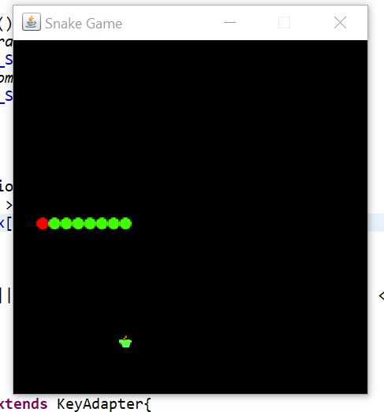
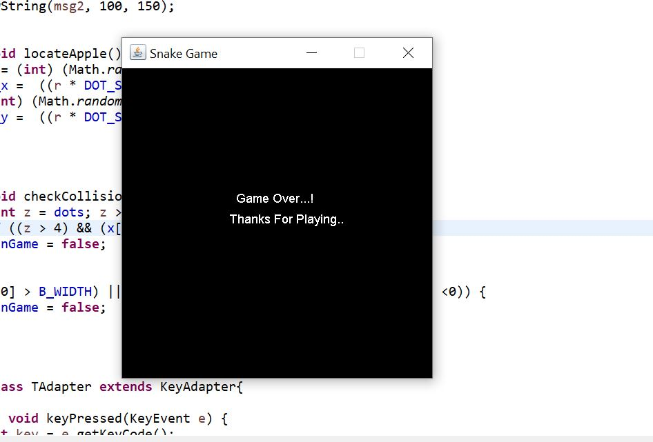

# Snake-Balls-Game
Snake Game developed using Core Java, Java-Swing &amp; Awt. 
A popular 90's kids "Game of Snake and balls", where a snake moves towards balls(mouse) and eats and grows every time.

pre-req: To developt this game you need basic knowledge of core java, swing

When you run the code, You will see game like this:

Game Over Cases:-

1.When snake touches it self.

2.When snake hits the wall.

References used:
http://zetcode.com/tutorials

